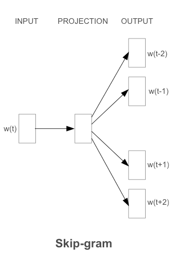
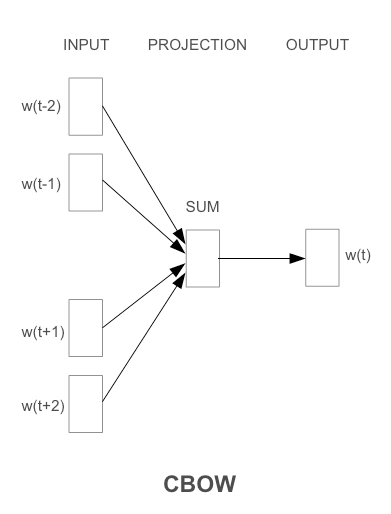

# Word2Vec

## 论文简介

Efficient Estimation of Word Representations in Vector Space（以下简称Word2vec）是一篇由Google的Tomas Mikolov等人于2013年发表的论文，该论文提出了一种基于神经网络的词向量训练方法，能够高效地学习到单词在向量空间中的分布式表示。

本篇论文是 2013 年发表在 ICLR 上的论文。在NLP领域拥有里程碑式的意义，以至于后期的ELMo、Bert、GPT都是受词向量的影响而诞生的。同时本篇论文也是受到神经语言模型NNLM的启发。

- 出处：https://arxiv.org/abs/1301.3781

- 作者：Tomas Mikolov, Kai Chen, Greg Corrado, Jeffrey Dean

- 单位：Google

- 发表年份：2013年


## 论文摘要

论文提出了两种新的模型架构(Skip-gram、CBOW)，用于从非常大的数据集中计算单词的连续向量表示。模型性能的衡量标准是 单词相似性任务 ，将结果与先前表现最佳的基于不同类型的神经网络的技术进行比较，观察到准确率有大幅提升，而计算成本则更低。例如：从一个16亿个单词的数据集中学习高质量单词向量只需不到一天的时间。

## NNLM 神经网络语言模型

NNLM由 **输入层、投影层、隐藏层、输出层** 组成。
在输入层N个词汇编码为 one-hot 形式的向量，V代表词表的大小，投影层P的维度为 N*D，隐藏层的维度为H，输出层的维度为V


## One-hot 编码

"One-hot" 编码是一种将离散数据表示为稀疏向量的方法，其中只有一个元素是 1，其余元素均为 0。在自然语言处理中，one-hot 编码常用于表示词汇表中的单词。这种编码方式的优点是简单且直观，但它也有一些限制，特别是在高维度的词汇表中，导致编码向量非常稀疏。

在论文中，针对one-hot编码的高维输入，主要的优化方法是使用嵌入层（Embedding Layer）。嵌入层是一个可学习的权重矩阵，它将高维的one-hot编码表示映射到一个低维的稠密向量空间中，从而获得更加紧凑的词向量表示。


## word2vec 的概念

Word2Vec是从大量文本语料中以 **无监督** 的方式学习语义知识的一种模型，它用词向量的方式表征词的语义信息，即通过一个嵌入空间使得语义上相似的单词在该空间内距离很近（word Embeding）。词嵌入是一种将单个词转换为词的数字表示（向量）的技术。每个单词都映射到一个向量，然后以类似于神经网络的方式学习该向量。向量试图捕捉该词相对于整个文本的各种特征。这些特征可以包括单词的语义关系、定义、上下文等。


## Skip-gram



#### 特点：

- 通过中心单词来预测上下文单词（输入是特定的一个词的词向量，而输出是特定词对应的上下文词向量）
- 将每个中心词作为一个连续投影层的对数线性分类器的输入
- 在当前单词前后预测一定范围内的单词
- 增加范围 $C$ 可以提高结果字向量的质量，但也增加了计算复杂度


#### 计算复杂度：

$$
Q=C\times(D+D\times log_2(V))
$$


#### 模型架构：

Skip-gram模型是一个浅层的神经网络，其中包含一个嵌入层（Embedding Layer）和一个Softmax输出层。下面是Skip-gram模型的详细神经网络架构：

1. **输入层：** Skip-gram模型的输入是一个表示目标词的独热编码向量（one-hot encoded vector）。这个向量的长度等于词汇表的大小，其中仅有目标词的索引位置为1，其余位置为0。

2. **嵌入层（Embedding Layer）：** 输入独热编码向量通过嵌入层，将目标词映射到低维的词向量。这个嵌入层的权重矩阵包含了所有词的词向量。

3. **投影层：** Skip-gram模型通常没有显式的投影层。嵌入层的输出就是目标词的词向量，直接用于之后的计算。

4. **Softmax 输出层：** Skip-gram模型的目标是通过Softmax输出层来最大化给定目标词情况下上下文词的条件概率。Softmax输出层的神经元个数等于词汇表的大小，每个神经元对应一个词。Softmax函数将网络的输出转换为概率分布，其中概率最大的位置对应于模型预测的上下文词。

训练过程中，Skip-gram模型通过反向传播算法和大量的文本数据来优化Softmax输出层的权重，以最大化给定目标词情况下上下文词的条件概率。优化过程中，嵌入层的权重也会被调整，使得在词向量空间中语义上相似的词更为接近。Skip-gram模型的神经网络架构是一个简单的两层神经网络，其中嵌入层起到将高维输入独热编码向量映射为低维词向量的作用，Softmax输出层用于进行上下文词的预测。


## CBOW



#### 特点：

- 通过上下文单词来预测中心单词 （输入是某一个特征词的上下文相关的词对应的词向量，而输出就是这特定的一个词的词向量）
- CBOW模型结构类似于**前馈神经网络**（NNLM），但是除去了隐藏层，而且将所有的投影层的向量做了求和运算。
- 之所以被称为连续词袋模型是因为历史的词序不会影响最终的结果。
- 在大多数情况下，用于**较小的数据集**。


#### 计算复杂度：

$$
Q=N\times D+D\times log_2(V)
$$


#### 模型架构：

1. **输入层：** 输入是一组上下文词的词向量，这些词向量通过求和或平均得到一个上下文向量。

2. **嵌入层（Embedding Layer）：** 上下文向量通过嵌入层，将其映射到目标词汇的词向量。嵌入层的权重矩阵包含了所有词的词向量。

3. **投影层：** 没有显式的投影层，嵌入层的输出直接用于之后的计算。

4. **Softmax 输出层：** CBOW模型的目标是通过Softmax输出层最大化给定上下文词情况下目标词的条件概率。Softmax输出层的神经元个数等于词汇表的大小，每个神经元对应一个词。

在CBOW模型中，通过训练过程，嵌入层的权重会被调整，以便将上下文向量映射到正确的目标词。CBOW模型的目标是最小化给定上下文词情况下目标词的负对数似然损失。CBOW模型的神经网络架构是一个简单的两层神经网络，其中嵌入层负责将上下文向量映射为目标词向量，Softmax输出层用于进行目标词的预测。与Skip-gram相比，CBOW更注重上下文的平均信息，因此在某些语境中可能在处理一些共现信息时更有效。


## word2vec 优化的四种方法

1. **Negative Sampling（负采样）：**

   在原始的Word2Vec模型中，Softmax函数被用于计算目标词的概率分布，这在大规模数据集上可能会变得计算昂贵。Negative Sampling是一种近似的方法，它通过仅更新一小部分负样本（非目标词）的向量来降低计算复杂度。这个方法通常可以在保持模型性能的同时提高训练速度。

2. **Subsampling：**

   对于高频词，由于它们在文本中出现频繁，可能会提供过多的信息，导致模型对它们过于关注。为了解决这个问题，可以使用Subsampling方法，即在训练过程中以一定的概率丢弃高频词。这有助于平衡对各种词的关注程度。

3. **Window Optimization：**

   Word2Vec模型使用上下文窗口来定义每个词的上下文。优化窗口大小可能对模型性能有影响。较小的窗口可能导致模型忽略较远的上下文信息，而较大的窗口可能导致模型过于关注远处的词。因此，通过调整上下文窗口的大小，可以优化模型的性能。

4. **Hierarchy Softmax：**

   在传统的Word2Vec中，Softmax函数用于计算目标词的概率分布。对于大型词汇表，这可能会导致计算开销巨大。Hierarchy Softmax是一种树状结构的概率计算方法，通过构建词汇表的树状结构，将计算复杂度从线性降低为对数级别，从而提高了效率。


## gensim - word2vec

[gensim官方文档](https://radimrehurek.com/gensim/models/word2vec.html)

使用Gensim训练Word2vec：

- 安装 Gensim 库

```
pip3 install gensim
```

#### gensim - word2vec 模型参数

1. **sentences (list of list of str):** 输入语料库，每个元素是一个句子，每个句子是一个单词列表。

2. **sg (int, optional, default=0):** 选择使用哪种模型。sg=0表示使用Skip-gram模型，sg=1表示使用CBOW模型。

3. **size (int, optional, default=100):** 词向量的维度，即每个词的向量表示的维数。

4. **window (int, optional, default=5):** 上下文窗口的大小，表示在训练过程中考虑目标词周围的词的范围。

5. **min_count (int, optional, default=5):** 忽略出现次数低于该值的单词。

6. **workers (int, optional, default=3):** 训练的并行度，表示使用多少个CPU核心来训练模型。

7. **sg (int, optional, default=0):** 选择使用哪种模型。sg=0表示使用Skip-gram模型，sg=1表示使用CBOW模型。

8. **hs (int or {0, 1}, optional, default=0):** 选择使用softmax（hs=0）还是负采样（hs=1）。负采样通常在小规模数据集上更快。

9. **negative (int, optional, default=5):** 对于负采样，设置多少个噪声词作为负样本。

10. **ns_exponent (float, optional, default=0.75):** 负采样的指数，通常取值在[0.5, 1.0]之间。

11. **alpha (float, optional, default=0.025):** 初始学习率。

12. **min_alpha (float, optional, default=0.0001):** 学习率的下限。学习率会在训练过程中逐渐减小。

13. **iter (int, optional, default=5):** 迭代次数，即训练数据的多少遍。


使用示例：

```python
from gensim.models import Word2Vec

# 训练Word2Vec模型
model = Word2Vec(sentences, vector_size=100, window=5, min_count=5, workers=4)

# 保存模型
model.save("word2vec_model.model")

# 加载模型
model = Word2Vec.load("word2vec_model.model")
```


#### 训练步骤

1. 语料库预处理:

   一行一个文档或句子，将文档或句子分词以空格分割（英文可以不用分词，英文单词之间已经由空格分割，中文预料需要使用分词工具进行分词，常见的分词工具有StandNLP、ICTCLAS、Ansj、FudanNLP、HanLP、结巴分词等）。

2. 将原始的训练语料转化成一个sentence的迭代器，每一次迭代返回的sentence是一个word（utf8格式）的列表。可以使用Gensim中word2vec.py中的`LineSentence()`方法实现；

   ```python
   # 使用 LineSentence 读取文本数据
   sentences = LineSentence(data_file)
   ```

3. 将上面处理的结果输入Gensim内建的word2vec对象进行训练

4. 默认用了CBOW模型，采用高频词抽样+负采样进行优化


#### 训练代码：

```python
from gensim.models import Word2Vec
from gensim.models.word2vec import LineSentence

# 替换为你的数据文件路径
data_file = 'path/to/your/data.txt'

# 使用 LineSentence 读取文本数据
sentences = LineSentence(data_file)

# 定义 Word2Vec 模型参数
model = Word2Vec(sentences, vector_size=100, window=5, min_count=5, workers=4)

# vector_size: 词向量的维度
# window: 上下文窗口大小，表示当前词与预测词的最大距离
# min_count: 忽略出现次数少于min_count的词
# workers: 训练并行化的线程数

# 训练模型
model.train(sentences, total_examples=model.corpus_count, epochs=10)

# 保存模型
model.save('path/to/save/model.bin')

# 加载模型
# model = Word2Vec.load('path/to/save/model.bin')

```

## Pytorch 实现 word2vec

```python
import torch
import torch.nn as nn
import torch.optim as optim
from torch.utils.data import DataLoader, Dataset

# 定义数据集类
class Word2VecDataset(Dataset):
    def __init__(self, text_data):
        self.text_data = text_data
        self.vocab = list(set(self.text_data))
        self.word_to_index = {word: idx for idx, word in enumerate(self.vocab)}
        self.index_to_word = {idx: word for idx, word in enumerate(self.vocab)}

    def __len__(self):
        return len(self.text_data)

    def __getitem__(self, idx):
        target_word = self.word_to_index[self.text_data[idx]]
        context_words = [self.word_to_index[word] for word in self.get_context(idx)]
        return target_word, context_words

    def get_context(self, idx, window_size=2):
        start = max(0, idx - window_size)
        end = min(len(self.text_data), idx + window_size + 1)
        context = [self.text_data[i] for i in range(start, end) if i != idx]
        return context

# 定义Skip-gram模型
class SkipGramModel(nn.Module):
    def __init__(self, vocab_size, embed_size):
        super(SkipGramModel, self).__init__()
        self.in_embed = nn.Embedding(vocab_size, embed_size)
        self.out_embed = nn.Embedding(vocab_size, embed_size)

    def forward(self, target, context):
        in_embeds = self.in_embed(target)
        out_embeds = self.out_embed(context)
        scores = torch.matmul(in_embeds, out_embeds.t())
        return scores

# 训练模型
def train_word2vec_model(text_data, embed_size=100, num_epochs=5, learning_rate=0.01):
    vocab_size = len(set(text_data))
    dataset = Word2VecDataset(text_data)
    data_loader = DataLoader(dataset, batch_size=64, shuffle=True)

    model = SkipGramModel(vocab_size, embed_size)
    criterion = nn.CrossEntropyLoss()
    optimizer = optim.SGD(model.parameters(), lr=learning_rate)

    for epoch in range(num_epochs):
        total_loss = 0
        for target, context in data_loader:
            optimizer.zero_grad()
            scores = model(target, context)
            loss = criterion(scores.view(-1, vocab_size), context.view(-1))
            loss.backward()
            optimizer.step()
            total_loss += loss.item()

        print(f'Epoch {epoch+1}/{num_epochs}, Loss: {total_loss/len(data_loader)}')

    return model, dataset.index_to_word

# 示例用法
text_data = ["the", "quick", "brown", "fox", "jumps", "over", "the", "lazy", "dog"]
model, index_to_word = train_word2vec_model(text_data)

# 获取词向量
word_idx = dataset.word_to_index["fox"]
word_vector = model.in_embed(torch.tensor(word_idx)).detach().numpy()

print(f"Vector for 'fox': {word_vector}")

```


## 语料库

**维基百科中文语料库：** 维基百科提供了大量多语言的文本数据，适用于训练多领域的Word2Vec模型。

[下载地址](https://dumps.wikimedia.org/zhwiki/latest/zhwiki-latest-pages-articles.xml.bz2)


## 论文源码

[GitHub 仓库-tmikolov-word2vec](https://github.com/tmikolov/word2vec)


------

## 参考资料

[通俗理解word2vec - 简书](https://www.jianshu.com/p/471d9bfbd72f)

[word2vec - csdn 人鱼线](https://blog.csdn.net/qfikh/article/details/103665681)

[Word2vec原理与实战 - 知乎](https://zhuanlan.zhihu.com/p/625218353)

[wikipedia - word2vec](https://en.wikipedia.org/wiki/Word2vec)

[word2vec 复现 - bilibili 深度之眼官方账号](https://www.bilibili.com/video/BV1zf4y1y7g6/?vd_source=547b016e6b48374046c7b0a9aafa4e54)