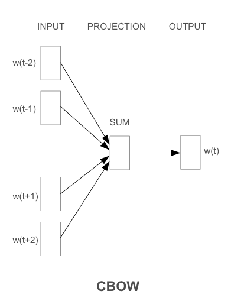

# Word2Vec

## 论文简介

Efficient Estimation of Word Representations in Vector Space（以下简称Word2vec）是一篇由Google的Tomas Mikolov等人于2013年发表的论文，该论文提出了一种基于神经网络的词向量训练方法，能够高效地学习到单词在向量空间中的分布式表示。

本篇论文是 2013 年发表在 ICLR 上的论文。在NLP领域拥有里程碑式的意义，以至于后期的ELMo、Bert、GPT都是受词向量的影响而诞生的。同时本篇论文也是受到神经语言模型NNLM的启发。

- 出处：https://arxiv.org/abs/1301.3781

- 作者：Tomas Mikolov, Kai Chen, Greg Corrado, Jeffrey Dean

- 单位：Google

- 发表年份：2013年


## 论文摘要

- 提出了两种新颖的模型结构用来计算词向量（Skip-gram、CBOW）
- 采用一种**词相似度的任务**来评估对比词向量质量
- 大量降低模型计算量可以提升词向量的质量
- 在语意和句法任务重，本文提出的词向量是当前最好的效果


## 前人的工作

### LSA

**Latent Semantic Analysis**（潜在语义分析），是一种用于文本挖掘和信息检索的技术。它的主要目标是通过分析大量文本数据中的语义关系，降低维度并发现潜在的语义结构。LSA常用于文本的主题建模和文档相似度计算。

关键概念和步骤：

1. **奇异值分解（Singular Value Decomposition，SVD）：** LSA的核心是使用奇异值分解来降维。在这个过程中，原始的文档-词矩阵被分解为三个矩阵的乘积：\[A = U \Sigma V^T\]，其中 \(A\) 是文档-词矩阵，\(U\) 和 \(V\) 是正交矩阵，\(\Sigma\) 是对角矩阵。通过保留奇异值最大的 \(k\) 个，我们可以获得一个低秩的近似矩阵。

2. **维度降低：** 通过保留与最大奇异值相对应的前 \(k\) 个奇异值，LSA将原始文档-词矩阵从高维空间降低到一个更低维的空间。这个新的表示捕捉了文档和词之间的潜在语义关系。

3. **语义空间：** 新的低维表示可以被看作是一个潜在的语义空间，其中文档和单词被映射到共享的语义空间中。这有助于发现文档之间的潜在语义关系，以及单词之间的语义相似性。

4. **文档相似性和主题建模：** 在降维后的语义空间中，可以通过计算文档之间的余弦相似度来度量它们的相似性。此外，通过分析在新空间中的主题结构，LSA可以被用于文本的主题建模。


### LDA

**Latent Dirichlet Allocation**（潜在狄利克雷分配），是一种用于主题建模的概率模型。它由Blei、Ng和Jordan于2003年提出，被广泛应用于文本挖掘、信息检索、推荐系统等领域。

LDA基于以下假设：每个文档是由**多个主题**组成的，而每个主题是由**多个单词**组成的。通过观察文档中的词语分布，LDA试图找到生成文档的潜在主题，以及每个主题中单词的分布。这样，LDA能够帮助我们揭示文本数据中的潜在主题结构。

关键概念和步骤：

1. **文档-主题分布：** LDA假设每个文档都是由多个主题的组合构成的，而每个主题是由一组单词组成的。每个文档可以被看作是一个主题分布的混合，其中每个主题的权重表示在文档中的重要程度。

2. **主题-词分布：** 每个主题都可以被看作是一个单词分布，其中每个单词的权重表示在该主题中的重要性。

3. **Dirichlet分布：** LDA使用Dirichlet分布来建模文档-主题和主题-词的分布。Dirichlet分布是一种多变量概率分布，用于表示多项分布的参数。在LDA中，Dirichlet分布用于表示文档-主题和主题-词分布的先验分布。

4. **抽样过程：** LDA使用马尔可夫链蒙特卡罗（MCMC）方法进行参数估计。通过迭代过程，LDA试图找到最优的文档-主题和主题-词分布，以最好地解释观察到的文档-词分布。


### 前馈神经网络语言模型（NNLM）

前馈神经网络语言模型（NNLM，Feedforward Neural Network Language Model）是一种用于学习词嵌入和建模语言的神经网络结构。NNLM 的目标是通过学习输入序列的分布来捕捉词语之间的语言模式和语义关系。

**模型架构：**

1. **输入层（Input Layer）：** 输入层接收一个窗口中的前 n-1 个词的词嵌入。每个词都被表示为一个固定维度的向量。这些词嵌入被连接成一个大的输入向量，作为输入传递给神经网络。

2. **隐藏层（Hidden Layers）：** NNLM 通常包含一个或多个隐藏层。每个隐藏层包含多个神经元，这些神经元通过权重参数与输入连接。隐藏层通过激活函数引入非线性变换，允许模型学习更复杂的语言模式。常见的激活函数包括 ReLU（Rectified Linear Unit）。

3. **输出层（Output Layer）：** 输出层是一个 softmax 层，它产生了下一个词的概率分布。每个输出单元对应于词汇表中的一个词。通过 softmax 函数，模型将隐藏层的输出映射到概率分布上，表示下一个词是词汇表中的哪一个。

   

**训练算法：**

1. **损失函数：** NNLM 使用**交叉熵损**失函数，用于衡量模型输出的概率分布与实际词的分布之间的差异。

2. **训练：** NNLM 通过**反向传播和梯度下降**等优化算法来训练。在训练期间，模型的参数被调整以**最小化损失函数**。

**计算复杂度：**
$$
Q = N × D + N × D × H + H × V
$$


**优点：**

- 能够学习复杂的语言模式

- 可以捕捉词语之间的语义关系

**缺点：**

- 对于长序列的建模困难

- 需要大量数据和计算资源来训练深层网络


### 循环神经网络语言模型（RNNLM）

**模型架构：**
RNNLM 是基于循环神经网络的语言模型，用于学习和生成文本数据。其基本模型架构包括：

1. **输入层（Input Layer）：** 接收每个时间步的输入，通常是前 n-1 个词的词嵌入。

2. **循环隐藏层（Recurrent Hidden Layer）：** 包含循环结构，使得模型可以保持记忆并捕捉文本序列中的长期依赖关系。

3. **输出层（Output Layer）：** 生成下一个词的概率分布，通过 softmax 函数进行归一化。


**训练算法：**

1. **初始化参数：** 初始化网络的权重和偏置。
   
2. **前向传播：** 对于每个时间步，通过输入层到隐藏层的连接，再到输出层，计算模型的预测概率分布。
   
3. **计算损失：** 使用交叉熵损失函数，比较模型的预测分布与实际词的分布，得到损失值。
   
4. **反向传播：** 通过反向传播算法，计算损失相对于网络参数的梯度。
   
5. **梯度更新：** 使用梯度下降或其他优化算法，更新网络参数以减小损失。


**计算复杂度：**
$$
Q=H\times H+H\times V
$$


**优点：**

- **序列建模：** RNNLM 适用于序列数据，能够捕捉文本中的长期依赖关系，有助于更好地理解语言的上下文。

- **灵活性：** RNNLM 具有灵活的模型架构，能够适应不同长度和结构的文本序列。

**缺点：**

- **梯度问题：** RNNLM 在训练中可能面临梯度消失或梯度爆炸的问题，尤其是在处理长序列时。

- **计算效率：** RNNLM 的计算效率相对较低，难以应对大规模数据集和长序列的训练需求。

- **短时记忆：** 基本的 RNN 结构对于长期依赖关系的建模能力有限，这可能导致生成文本的一致性和合理性不足。


### 并行网络计算

为了在**巨大的数据集**上训练模型，作者在 DistBelief 大规模分布式框架之上实现了多个模型，包括**前馈 NNLM** 和 **本文提出的新模型**。该框架能够实现并行运行同一模型的多个副本**，并且每个副本通过保留所有参数的集中式服务器同步其梯度更新。对于这种并行训练，作者使用**小批量异步梯度下降和 Adagrad 优化器 。在此框架下，通常使用一百个或更多模型副本，每个副本在数据中心的不同机器上使用许多 CPU 核心。


## word2vec 的概念

Word2Vec 一种**基于神经网络的词嵌入算法**，用于将文本中的词汇映射到实数向量。Word2Vec是从大量文本语料中以 **无监督** 的方式学习语义知识的一种模型，它用词向量的方式表征词的语义信息，即通过一个嵌入空间使得语义上相似的单词在该空间内距离很近（word Embeding）。

词嵌入是一种将单个词转换为词的数字表示（向量）的技术。每个单词都映射到一个向量，然后以类似于神经网络的方式学习该向量。向量试图捕捉该词相对于整个文本的各种特征。这些特征可以包括单词的语义关系、定义、上下文等。

Word2Vec有两个主要的模型：Skip-gram和Continuous Bag of Words (CBOW)。这两个模型都是基于神经网络的，通过学习预测上下文词汇或目标词汇来产生词嵌入。


## Skip-gram


#### 特点：

- 通过中心单词来预测上下文单词（输入是特定的一个词的词向量，而输出是特定词对应的上下文词向量）
- 将每个中心词作为一个连续投影层的对数线性分类器的输入
- 在当前单词前后预测一定范围内的单词
- 增加范围 $C$ 可以提高结果字向量的质量，但也增加了计算复杂度


#### 计算复杂度：

$$
Q=C\times(D+D\times log_2(V))
$$

各个字母的含义：

- \(Q\)：训练复杂度（Training Complexity）。
- \(C\)：上下文窗口的大小，表示在当前词周围的单词范围内进行预测的窗口大小。
- \(D\)：词向量的维度。
- \(V\)：词汇表的大小（即不同单词的数量）。

#### 模型架构：


1. **输入层：** Skip-gram模型的输入是一个表示目标词的独热编码向量（one-hot encoded vector）。这个向量的长度等于词汇表的大小，其中仅有目标词的索引位置为1，其余位置为0。

2. **嵌入层（Embedding Layer）：** 输入独热编码向量通过嵌入层，将目标词映射到低维的词向量。这个嵌入层的权重矩阵包含了所有词的词向量。

3. **投影层：** Skip-gram模型通常没有显式的投影层。嵌入层的输出就是目标词的词向量，直接用于之后的计算。

4. **Softmax 输出层：** Skip-gram模型的目标是通过Softmax输出层来最大化给定目标词情况下上下文词的条件概率。Softmax输出层的神经元个数等于词汇表的大小，每个神经元对应一个词。Softmax函数将网络的输出转换为概率分布，其中概率最大的位置对应于模型预测的上下文词。


训练过程中，Skip-gram模型通过反向传播算法和大量的文本数据来优化Softmax输出层的权重，以最大化给定目标词情况下上下文词的条件概率。优化过程中，嵌入层的权重也会被调整，使得在词向量空间中语义上相似的词更为接近。Skip-gram模型的神经网络架构是一个简单的两层神经网络，其中嵌入层起到将高维输入独热编码向量映射为低维词向量的作用，Softmax输出层用于进行上下文词的预测。

#### 优缺点：

**优点：**

> - Skip-gram 在处理罕见词汇方面效果较好。
> - Skip-gram 能够学到词汇之间的语义关系，因为在相似上下文中的词被认为有相似的含义。
> - 由于 Skip-gram 考虑了上下文信息，它能够更好地处理多义词。


**缺点：**

> - Skip-gram 模型在大规模语料库上的训练需要大量计算资源和时间。
> - 在 Skip-gram 中，每个词的词向量是一个单独的参数，当语料库很大时，这会导致词向量矩阵非常大，而且词向量是稀疏的，会导致存储和计算效率的问题。
> - 对于某些上下文信息较为复杂或抽象的语义关系，Skip-gram 无法很好地捕捉。


## CBOW



#### 简介：

CBOW的基本思想是，给定一个单词的上下文（即窗口内的其他单词），预测该单词本身。例如，对于句子“The cat climbed up the tree”，如果窗口大小为5，那么当中心单词为“climbed”时，上下文单词为“The”、“cat”、“up”和“the”。CBOW模型要求根据这四个上下文单词，计算出“climbed”的概率分布。

#### 特点：

- 通过上下文单词来预测中心单词 （输入是某一个特征词的上下文相关的词对应的词向量，而输出就是这特定的一个词的词向量）
- CBOW模型结构类似于**前馈神经网络**（NNLM），但是除去了隐藏层，而且将所有的投影层的向量做了求和运算。
- 之所以被称为连续词袋模型是因为历史的词序不会影响最终的结果。
- 在大多数情况下，用于**较小的数据集**。


#### 计算复杂度：

$$
Q=N\times D+D\times log_2(V)
$$

各个字母的含义：

- \(Q\)：训练复杂度（Training Complexity）。
- \(N\)：训练样本的数量。
- \(D\)：词向量的维度。
- \(V\)：词汇表的大小（即不同单词的数量）。

#### 模型架构：

1. **输入层：** 输入是一组上下文词的词向量，这些词向量通过求和或平均得到一个上下文向量。

2. **嵌入层（Embedding Layer）：** 上下文向量通过嵌入层，将其映射到目标词汇的词向量。嵌入层的权重矩阵包含了所有词的词向量。

3. **投影层：** 没有显式的投影层，嵌入层的输出直接用于之后的计算。

4. **Softmax 输出层：** CBOW模型的目标是通过Softmax输出层最大化给定上下文词情况下目标词的条件概率。Softmax输出层的神经元个数等于词汇表的大小，每个神经元对应一个词。

#### 优缺点：

> 优点:
>
> - 能够利用大规模语料库进行训练
> - 能够学习到高质量且低维度（通常在50~300之间） 的稠密向量，节省存储空间和计算资源
> - 能够捕捉单词之间的复杂关系，如同义词、反义词、类比关系等


> 缺点：
>
> - 忽略了上下文单词的顺序，只考虑了它们的累加效果
> - 对于低频或者生僻单词，可能无法生成准确的词向量
> - 需要大量的训练时间和内存空间


## word2vec 主要的优化方法

1. **Negative Sampling（负采样）：**
   
   在原始的Word2Vec模型中，Softmax函数被用于计算目标词的概率分布，这在大规模数据集上可能会变得计算昂贵。Negative Sampling是一种近似的方法，它通过仅更新一小部分负样本（非目标词）的向量来降低计算复杂度。这个方法通常可以在保持模型性能的同时提高训练速度。

4. **Hierarchy Softmax（层序 Softmax）：**

   在传统的Word2Vec中，Softmax函数用于计算目标词的概率分布。对于大型词汇表，这可能会导致计算开销巨大。Hierarchy Softmax是一种树状结构的概率计算方法，通过构建词汇表的树状结构，将计算复杂度从线性降低为对数级别，从而提高了效率。


## gensim 实现 word2vec

[gensim官方文档](https://radimrehurek.com/gensim/models/word2vec.html)

使用Gensim训练Word2vec：

- 安装 Gensim 库

```
pip3 install gensim
```

#### gensim - word2vec 模型参数

1. **sentences (list of list of str):** 输入语料库，每个元素是一个句子，每个句子是一个单词列表。

2. **sg (int, optional, default=0):** 选择使用哪种模型。sg=0表示使用Skip-gram模型，sg=1表示使用CBOW模型。

3. **size (int, optional, default=100):** 词向量的维度，即每个词的向量表示的维数。

4. **window (int, optional, default=5):** 上下文窗口的大小，表示在训练过程中考虑目标词周围的词的范围。

5. **min_count (int, optional, default=5):** 忽略出现次数低于该值的单词。

6. **workers (int, optional, default=3):** 训练的并行度，表示使用多少个CPU核心来训练模型。

7. **sg (int, optional, default=0):** 选择使用哪种模型。sg=0表示使用Skip-gram模型，sg=1表示使用CBOW模型。

8. **hs (int or {0, 1}, optional, default=0):** 选择使用softmax（hs=0）还是负采样（hs=1）。负采样通常在小规模数据集上更快。

9. **negative (int, optional, default=5):** 对于负采样，设置多少个噪声词作为负样本。

10. **ns_exponent (float, optional, default=0.75):** 负采样的指数，通常取值在[0.5, 1.0]之间。

11. **alpha (float, optional, default=0.025):** 初始学习率。

12. **min_alpha (float, optional, default=0.0001):** 学习率的下限。学习率会在训练过程中逐渐减小。

13. **iter (int, optional, default=5):** 迭代次数，即训练数据的多少遍。


使用示例：

```python
from gensim.models import Word2Vec

# 训练Word2Vec模型
model = Word2Vec(sentences, vector_size=100, window=5, min_count=5, workers=4)

# 保存模型
model.save("word2vec_model.model")

# 加载模型
model = Word2Vec.load("word2vec_model.model")
```


#### 训练步骤

1. 语料库预处理:

   一行一个文档或句子，将文档或句子分词以空格分割（英文可以不用分词，英文单词之间已经由空格分割，中文预料需要使用分词工具进行分词，常见的分词工具有StandNLP、ICTCLAS、Ansj、FudanNLP、HanLP、结巴分词等）。

2. 将原始的训练语料转化成一个sentence的迭代器，每一次迭代返回的sentence是一个word（utf8格式）的列表。可以使用Gensim中word2vec.py中的`LineSentence()`方法实现；

   ```python
   # 使用 LineSentence 读取文本数据
   sentences = LineSentence(data_file)
   ```

3. 将上面处理的结果输入Gensim内建的word2vec对象进行训练

4. 默认用了CBOW模型，采用高频词抽样+负采样进行优化


#### 训练代码：

```python
from gensim.models import Word2Vec
from gensim.models.word2vec import LineSentence

# 替换为你的数据文件路径
data_file = 'path/to/your/data.txt'

# 使用 LineSentence 读取文本数据
sentences = LineSentence(data_file)

# 定义 Word2Vec 模型参数
model = Word2Vec(sentences, vector_size=100, window=5, min_count=5, workers=4)

# vector_size: 词向量的维度
# window: 上下文窗口大小，表示当前词与预测词的最大距离
# min_count: 忽略出现次数少于min_count的词
# workers: 训练并行化的线程数

# 训练模型
model.train(sentences, total_examples=model.corpus_count, epochs=10)

# 保存模型
model.save('path/to/save/model.bin')

# 加载模型
# model = Word2Vec.load('path/to/save/model.bin')

```

## Pytorch 实现 word2vec

```python
import torch
import torch.nn as nn
import torch.optim as optim
from torch.utils.data import DataLoader, Dataset

# 定义数据集类，处理Word2Vec模型的训练数据


class Word2VecDataset(Dataset):
    # 初始化数据集
    def __init__(self, text_data):
        self.text_data = text_data
        # 将text_data中的词语转换为集合（set），去除重复的词语，然后再转换为列表（list）
        self.vocab = list(set(self.text_data))
        # 创建一个从词语到索引的映射，每个词语被映射为一个索引
        self.word_to_index = {word: idx for idx, word in enumerate(self.vocab)}
        # 创建一个从索引到词语的映射，每个索引对应于self.vocab中的一个词语
        self.index_to_word = {idx: word for idx, word in enumerate(self.vocab)}

    # 返回数据集的大小
    def __len__(self):
        return len(self.text_data)

    # 返回目标词和上下文词
    def __getitem__(self, idx):
        target_word = self.word_to_index[self.text_data[idx]]
        context_words = [self.word_to_index[word]
                         for word in self.get_context(idx)]
        return target_word, context_words

    # 获取上下文词
    def get_context(self, idx, window_size=2):
        start = max(0, idx - window_size)
        end = min(len(self.text_data), idx + window_size + 1)
        context = [self.text_data[i] for i in range(start, end) if i != idx]
        return context

# 定义Skip-gram模型
class SkipGramModel(nn.Module):
    def __init__(self, vocab_size, embed_size):
        super(SkipGramModel, self).__init__()
        # 两个嵌入层，分别用于表示输入词和输出词
        self.in_embed = nn.Embedding(vocab_size, embed_size)
        self.out_embed = nn.Embedding(vocab_size, embed_size)

    # 前向传播，计算目标词和上下文词之间的得分
    def forward(self, target, context):
        in_embeds = self.in_embed(target)
        out_embeds = self.out_embed(context)
        scores = torch.matmul(in_embeds, out_embeds.t())
        return scores

# 定义 CBOW 模型
class CBOWModel(nn.Module):
    def __init__(self, vocab_size, embed_size):
        super(CBOWModel, self).__init__()

        # 定义输入和输出的Embedding层
        self.in_embed = nn.Embedding(vocab_size, embed_size)
        self.out_embed = nn.Embedding(vocab_size, embed_size)

    # 前向传播，输入是上下文词的嵌入向量，输出是目标词的得分
    def forward(self, context):
        # 获取上下文词的嵌入向量并对它们进行求和
        context_embeds = self.in_embed(context)
        sum_embeds = torch.sum(context_embeds, dim=1)

        # 计算求和后的嵌入向量与目标词嵌入之间的得分
        scores = torch.matmul(sum_embeds, self.out_embed.weight.t())

        # 返回得分
        return scores


# 训练模型
def train_word2vec_model(text_data, embed_size=100, num_epochs=5, learning_rate=0.01):
    # 获取词汇表大小和创建数据集对象
    vocab_size = len(set(text_data))
    dataset = Word2VecDataset(text_data)

    # 创建 DataLoader
    data_loader = DataLoader(dataset, batch_size=64, shuffle=True)
    
    # 初始化Skip-gram模型、损失函数和优化器:
    model = SkipGramModel(vocab_size, embed_size)
    # 使用交叉熵损失函数
    criterion = nn.CrossEntropyLoss()
    # 使用随机梯度下降（SGD）优化器，学习率为 0.01
    optimizer = optim.SGD(model.parameters(), lr=learning_rate)

    for epoch in range(num_epochs):
        total_loss = 0
        for target, context in data_loader:
            # 清零之前的梯度，以避免梯度累积
            optimizer.zero_grad()
            # 计算模型的输出得分
            scores = model(target, context)
            # 计算模型输出与真实值之间的损失
            loss = criterion(scores.view(-1, vocab_size), context.view(-1))
            # 反向传播，计算梯度
            loss.backward()
            # 根据梯度更新模型参数
            optimizer.step()
            total_loss += loss.item()

        # 在每个epoch结束时打印平均损失
        print(
            f'Epoch {epoch+1}/{num_epochs}, Loss: {total_loss/len(data_loader)}')
        
    # 返回训练好的模型和词汇表索引映射
    return model, dataset


```


## 语料库

**维基百科中文语料库：** 维基百科提供了大量多语言的文本数据，适用于训练多领域的Word2Vec模型。

[下载地址](https://dumps.wikimedia.org/zhwiki/latest/zhwiki-latest-pages-articles.xml.bz2)


## 论文源码

[GitHub 仓库-tmikolov-word2vec](https://github.com/tmikolov/word2vec)


